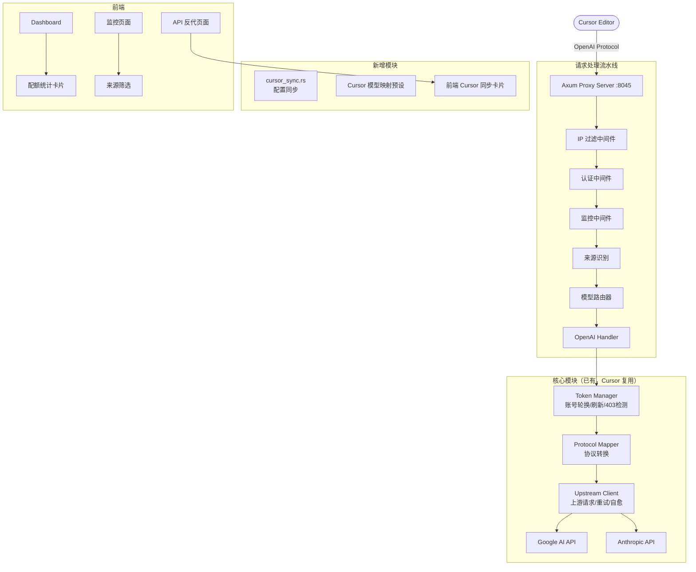

# 设计文档：Cursor 编辑器适配

## 概述

本设计将 Cursor 编辑器作为新的外部客户端集成到 Antigravity Tools 现有架构中。由于 Cursor 使用 OpenAI 兼容协议，核心代理路径（`/v1/chat/completions`、`/v1/models`）已由现有的 `handlers::openai` 模块处理。本适配的主要工作集中在以下几个方面：

1. **Cursor 请求识别与标记** — 通过请求头（`User-Agent`、`x-cursor-*`）识别 Cursor 来源
2. **Cursor 配置同步模块** — 新增 `cursor_sync.rs`，遵循 `cli_sync.rs` / `opencode_sync.rs` 的模式
3. **Cursor 专用模型映射预设** — 将 Cursor 常见模型 ID 映射到 Antigravity 支持的上游模型
4. **前端 Cursor 同步卡片** — 在 API 反代页面添加 Cursor Provider 卡片
5. **监控与日志增强** — 在日志中标记 Cursor 来源，支持按来源筛选

现有的账号管理（OAuth 2.0、Token 刷新、403 检测）、智能自愈（429/401/503 重试）、配额保护、分级路由、安全防护等功能已完整实现，Cursor 请求将自动复用这些能力，无需重复实现。

## 架构



## 组件与接口

### 1. Cursor 配置同步模块 (`cursor_sync.rs`)

遵循 `opencode_sync.rs` 的模式，新增 `src-tauri/src/proxy/cursor_sync.rs`。

```rust
// 核心数据结构
pub struct CursorSyncStatus {
    pub installed: bool,
    pub config_path: Option<String>,
    pub is_synced: bool,
    pub has_backup: bool,
    pub current_base_url: Option<String>,
}

// 核心接口
pub fn check_cursor_installed() -> (bool, Option<String>);
pub fn get_cursor_config_dir() -> Option<PathBuf>;
pub fn get_sync_status(proxy_url: &str, api_key: &str) -> CursorSyncStatus;
pub fn sync_config(proxy_url: &str, api_key: &str) -> Result<(), String>;
pub fn restore_config() -> Result<(), String>;
pub fn get_config_content() -> Result<String, String>;
```

**配置文件路径检测逻辑**：
- macOS: `~/Library/Application Support/Cursor/User/settings.json`
- Windows: `%APPDATA%/Cursor/User/settings.json`
- Linux: `~/.config/Cursor/User/settings.json`

**同步写入的 JSON 字段**：
```json
{
  "openai.apiKey": "sk-antigravity",
  "openai.baseUrl": "http://127.0.0.1:8045/v1"
}
```

### 2. Cursor 请求来源识别

在现有的监控中间件 (`middleware/monitor.rs`) 中增强来源检测逻辑：

```rust
fn detect_client_source(headers: &HeaderMap) -> String {
    // 检测 User-Agent 中的 "cursor" 关键词
    if let Some(ua) = headers.get("user-agent").and_then(|v| v.to_str().ok()) {
        let ua_lower = ua.to_lowercase();
        if ua_lower.contains("cursor") {
            return "cursor".to_string();
        }
        // ... 其他客户端检测
    }
    // 检测 Cursor 特有请求头
    if headers.keys().any(|k| k.as_str().starts_with("x-cursor")) {
        return "cursor".to_string();
    }
    "unknown".to_string()
}
```

### 3. Cursor 模型映射预设

在 `proxy/config.rs` 或独立的 `cursor_models.rs` 中定义 Cursor 默认映射：

```rust
pub fn get_cursor_default_mapping() -> HashMap<String, String> {
    let mut map = HashMap::new();
    // GPT 系列 → Gemini
    map.insert("gpt-4".into(), "gemini-3-pro-high".into());
    map.insert("gpt-4o".into(), "gemini-3-pro-high".into());
    map.insert("gpt-4o-mini".into(), "gemini-3-flash".into());
    map.insert("gpt-3.5-turbo".into(), "gemini-3-flash".into());
    map.insert("gpt-4-turbo".into(), "gemini-3-pro-high".into());
    // Claude 系列 → Claude (直通)
    map.insert("claude-3.5-sonnet".into(), "claude-sonnet-4-5".into());
    map.insert("claude-3-opus".into(), "claude-opus-4-6-thinking".into());
    map.insert("claude-3-sonnet".into(), "claude-sonnet-4-5".into());
    map.insert("claude-3-haiku".into(), "gemini-3-flash".into());
    // Cursor 特有模型名
    map.insert("cursor-small".into(), "gemini-3-flash".into());
    map.insert("cursor-large".into(), "gemini-3-pro-high".into());
    map
}
```

### 4. 后端 API 端点（Admin Routes）

在 `server.rs` 的 admin_routes 中新增 Cursor 同步相关端点：

```rust
// 新增路由
.route("/proxy/cursor/status", post(admin_get_cursor_sync_status))
.route("/proxy/cursor/sync", post(admin_execute_cursor_sync))
.route("/proxy/cursor/restore", post(admin_execute_cursor_restore))
.route("/proxy/cursor/config", post(admin_get_cursor_config_content))
.route("/proxy/cursor/preset", get(admin_get_cursor_model_preset))
.route("/proxy/cursor/preset/apply", post(admin_apply_cursor_model_preset))
```

### 5. 前端组件

**CursorSyncCard 组件** — 放置在 `src/components/proxy/CursorSyncCard.tsx`：
- 展示 Cursor 安装状态和同步状态
- 提供同步/恢复/查看配置按钮
- 展示模型映射预设导入按钮
- 遵循现有 CLI Sync 卡片的 UI 模式

**监控页面增强** — 在 `src/pages/Monitor.tsx` 中：
- 添加来源筛选下拉框（All / Cursor / Claude Code / OpenCode / Other）
- 在日志列表中展示来源标签

**Dashboard 增强** — 在 `src/pages/Dashboard.tsx` 中：
- 添加 Cursor 请求统计卡片（可选，复用现有统计组件）

## 数据模型

### CursorSyncStatus（Rust 后端）

```rust
#[derive(Debug, Serialize, Deserialize, Clone)]
pub struct CursorSyncStatus {
    /// Cursor 是否已安装
    pub installed: bool,
    /// Cursor 配置文件路径
    pub config_path: Option<String>,
    /// 是否已同步 Antigravity 配置
    pub is_synced: bool,
    /// 是否存在备份文件
    pub has_backup: bool,
    /// 当前配置中的 Base URL
    pub current_base_url: Option<String>,
}
```

### CursorModelPreset（Rust 后端）

```rust
#[derive(Debug, Serialize, Deserialize, Clone)]
pub struct CursorModelPreset {
    /// 预设名称
    pub name: String,
    /// 模型映射表 (Cursor 模型 ID → Antigravity 上游模型 ID)
    pub mappings: HashMap<String, String>,
}
```

### ProxyLogEntry 增强（已有，增加字段）

```rust
// 在现有的 ProxyLogEntry 中增加
pub struct ProxyLogEntry {
    // ... 现有字段
    /// 请求来源标识 (cursor, claude-code, opencode, unknown)
    pub client_source: Option<String>,
}
```

### 前端类型定义

```typescript
// src/types/cursor.ts
interface CursorSyncStatus {
  installed: boolean;
  configPath: string | null;
  isSynced: boolean;
  hasBackup: boolean;
  currentBaseUrl: string | null;
}

interface CursorModelPreset {
  name: string;
  mappings: Record<string, string>;
}
```

## 正确性属性

*正确性属性是一种在系统所有有效执行中都应成立的特征或行为——本质上是关于系统应该做什么的形式化陈述。属性是人类可读规范与机器可验证正确性保证之间的桥梁。*

### Property 1: 批量导入结果准确性
*对于任意*一批包含有效和无效 Token 的账号导入请求，导入结果中的成功数应等于有效 Token 的数量，失败数应等于无效 Token 的数量，且两者之和等于总导入数量。
**Validates: Requirements 1.3**

### Property 2: Token 过期触发刷新
*对于任意*账号，当其 Access Token 的 `expiry_timestamp` 小于当前时间加 300 秒时，`ensure_fresh_token` 函数应触发 Token 刷新流程并返回新的 Token。
**Validates: Requirements 1.4**

### Property 3: 账号代理状态切换反映到调度池
*对于任意*账号，当其代理状态从启用切换为禁用后，Token Manager 的 `get_token` 方法不应返回该账号；当从禁用切换为启用后，该账号应重新参与调度。
**Validates: Requirements 1.6**

### Property 4: 被封禁账号在调度中被跳过
*对于任意*被标记为 `is_forbidden` 的账号，无论是在运行时检测到 403 还是在预热过程中检测到 403，Token Manager 的调度逻辑都不应选择该账号。
**Validates: Requirements 1.7, 11.2**

### Property 5: Cursor 来源识别与日志标记
*对于任意*包含 "cursor" 关键词的 User-Agent 请求头或包含 `x-cursor-*` 前缀请求头的 HTTP 请求，来源检测函数应返回 "cursor"，且对应的日志条目的 `client_source` 字段应为 "cursor"。
**Validates: Requirements 2.1, 9.4**

### Property 6: Cursor 特有请求头在转发时被移除
*对于任意*包含 `x-cursor-*` 前缀请求头的请求，转发到上游的请求中不应包含任何 `x-cursor-*` 前缀的请求头。
**Validates: Requirements 2.5**

### Property 7: 工具调用格式转换往返一致性
*对于任意*有效的 OpenAI 格式工具调用请求，将其转换为上游格式再转换回 OpenAI 格式后，工具名称、参数和调用 ID 应与原始请求等价。
**Validates: Requirements 2.6, 2.7**

### Property 8: 模型映射正确性
*对于任意*存在于映射表中的模型 ID（包括 GPT 系列和 Claude 系列），Model Router 应返回映射表中对应的上游模型 ID。
**Validates: Requirements 3.1, 3.2**

### Property 9: 自定义映射优先于默认预设
*对于任意*同时存在于用户自定义映射和默认预设中的模型 ID，Model Router 应使用用户自定义映射的目标模型，而非默认预设的目标模型。
**Validates: Requirements 3.4**

### Property 10: 未知模型返回 404
*对于任意*不存在于映射表中且不匹配任何通用映射规则的模型 ID，Model Router 应返回 HTTP 404 错误。
**Validates: Requirements 3.5**

### Property 11: 配置同步-恢复往返一致性
*对于任意*有效的 Cursor `settings.json` 配置文件，执行同步操作后再执行恢复操作，恢复后的文件内容应与原始文件内容完全一致。
**Validates: Requirements 4.4**

### Property 12: 配置同步保留非 AI 代理字段
*对于任意*包含任意用户自定义设置的 Cursor `settings.json` 配置文件，执行同步操作后，除 AI 代理相关字段（`openai.apiKey`、`openai.baseUrl`）外的所有字段应保持不变。
**Validates: Requirements 4.6**

### Property 13: 配额保护生命周期
*对于任意*账号，当其配额低于保护阈值时应被移出可用池；当配额恢复到安全水平后应被重新加入可用池。保护前后账号的其他属性应保持不变。
**Validates: Requirements 6.3, 6.5**

### Property 14: 安全中间件对 Cursor 请求生效
*对于任意*来自 Cursor 的请求，当 API Key 无效时应返回 401；当 IP 在黑名单中时应返回 403；当 IP 不在白名单中（白名单启用时）应返回 403；当超过速率限制时应返回 429。
**Validates: Requirements 8.1, 8.2, 8.3, 8.4**

### Property 15: 分级路由优先级
*对于任意*包含不同层级（Ultra/Pro/Free）账号的账号池，当 Ultra 账号可用时，交互式请求应优先路由到 Ultra 账号。
**Validates: Requirements 10.1, 10.3**

### Property 16: 后台任务路由到轻量模型
*对于任意*被识别为后台任务的请求（如代码补全建议、标题生成），Model Router 应将其路由到 Flash 等轻量模型而非 Pro 等高级模型。
**Validates: Requirements 10.2**

### Property 17: 粘性会话一致性
*对于任意*启用了粘性会话的配置，同一会话 ID 的连续请求应使用同一账号（当该账号仍然可用时）。
**Validates: Requirements 10.4**

## 错误处理

### 网络与上游错误

| 错误类型 | 处理策略 | 对应需求 |
|---------|---------|---------|
| HTTP 429 (Too Many Requests) | 300ms 内自动切换账号重试 | 5.1 |
| HTTP 401 (Unauthorized) | 尝试刷新 Token，失败则切换账号 | 5.2 |
| HTTP 503 (Service Unavailable) | 递增间隔重试，最多 3 次 | 5.3 |
| HTTP 404 (Not Found) | 300ms 短延迟重试，切换账号 | 5.6 |
| 所有账号限流 | 返回 503 + 预计恢复时间 | 5.4 |
| Token 刷新失败 | 标记账号不可用，记录日志 | 1.5 |
| 403 封禁 | 标记 is_forbidden，跳过调度 | 1.7 |

### 配置同步错误

| 错误类型 | 处理策略 | 对应需求 |
|---------|---------|---------|
| Cursor 未安装 | 返回描述性错误，指明期望路径 | 4.5 |
| 配置文件不存在 | 返回错误信息 | 4.5 |
| 配置文件写入失败 | 返回错误信息，不修改原文件 | 4.2 |
| 备份文件不存在 | 恢复操作返回错误 | 4.4 |
| JSON 解析失败 | 返回错误信息，不修改原文件 | 4.6 |

## 测试策略

### 属性测试（Property-Based Testing）

使用 Rust 的 `proptest` 库进行属性测试，每个属性测试至少运行 100 次迭代。

**重点属性测试**：
- Property 7（工具调用格式往返）— 生成随机工具调用请求，验证转换往返一致性
- Property 8（模型映射正确性）— 生成随机模型 ID，验证映射结果
- Property 11（配置同步-恢复往返）— 生成随机 settings.json 内容，验证同步恢复一致性
- Property 12（配置同步保留非 AI 字段）— 生成包含随机字段的 settings.json，验证非 AI 字段不变

每个属性测试必须以注释标注对应的设计属性编号：
```rust
// Feature: cursor-adapter, Property 11: 配置同步-恢复往返一致性
#[test]
fn prop_config_sync_restore_roundtrip() { ... }
```

### 单元测试

**Cursor 配置同步模块** (`cursor_sync.rs`)：
- 测试跨平台路径检测逻辑
- 测试 JSON 字段合并逻辑
- 测试备份创建和恢复
- 测试 Cursor 未安装时的错误处理

**来源识别逻辑**：
- 测试各种 User-Agent 字符串的识别
- 测试 x-cursor-* 请求头的检测
- 测试未知来源的默认处理

**模型映射预设**：
- 测试默认预设包含所有预期模型
- 测试自定义映射覆盖默认预设
- 测试未知模型的 404 响应

### 前端测试

- CursorSyncCard 组件的渲染测试
- 同步/恢复按钮的交互测试
- 来源筛选功能的过滤逻辑测试

### 属性测试库配置

```toml
# Cargo.toml (dev-dependencies)
[dev-dependencies]
proptest = "1.4"
```

```json
// package.json (devDependencies) - 前端属性测试（可选）
{
  "fast-check": "^3.15.0"
}
```
